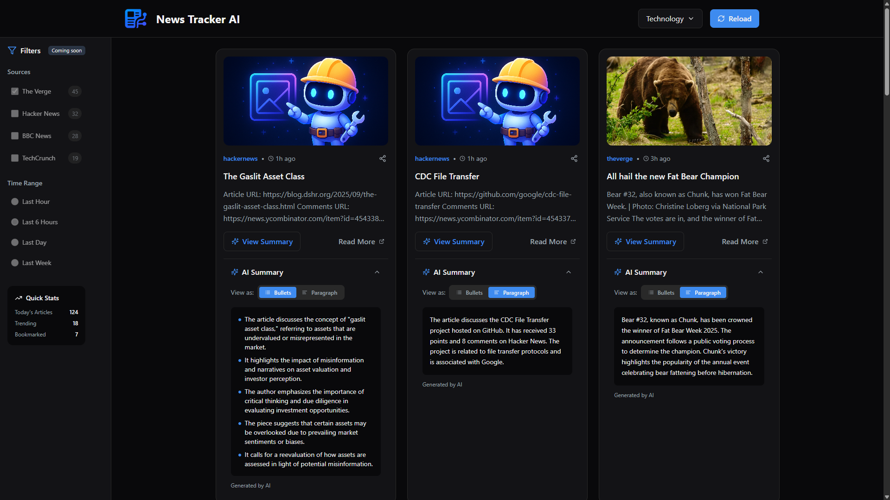

<p align="center">
  
</p>

<p align="center">
  <b>Aspiring Software Engineer | Computer Science Student | Based in Barrie, Canada</b>
</p>

<p align="center">
  
</p>

---

## 🚀 Featured Projects  

| Project | Description |
|---------|-------------|
| 🌐 [**News Tracker AI**](https://news-tracker-ai.vercel.app) <br> [](https://news-tracker-ai.vercel.app) [](https://github.com/tranbaokien2005/news-tracker-ai/actions/workflows/ci.yml) [](https://news-tracker-api.onrender.com/api/v1/health) <br> 🔹 [Frontend Repo](https://github.com/tranbaokien2005/news-tracker-fe) · 🔹 [Backend Repo](https://github.com/tranbaokien2005/news-tracker-be) | Full-stack web app built with **Node.js (Express)** + **Vite/React**. Fetches & normalizes news from RSS feeds, caches results, and provides **AI-powered summaries** (OpenAI). CI/CD via GitHub Actions + Vercel/Render. |
| 📱 [**Movie Search Android App**](https://github.com/tranbaokien2005/movie-search-android-app) | Android app built with **MVVM**, **LiveData**, and **Retrofit**. Fetches movie data from OMDB API and supports CRUD with Firebase Firestore. |
| 🛒 **Shopee UI Clone (HTML/CSS/JS)** | Responsive eCommerce interface inspired by Shopee Vietnam. |
| 🌐 *Portfolio Website (In Progress)* | Built with React & Tailwind CSS to showcase skills and projects. |

<p align="center">
  
  <br/>
  <i>Screenshot of the live News Tracker AI app (deployed on Vercel)</i>
</p>

---

## 💖 About Me  

- 🎓 Bachelor’s in **Computer Science** (Georgian College & Lakehead University).  
- 🚀 Passionate about **Software Development** & **Web Technologies**.  
- 📚 Currently learning **JavaScript**, **React**, and **System Design**.  
- 🧠 Practicing **Data Structures & Algorithms** daily for interviews.  
- 🌟 Dream: intern at top **tech companies** and grow into a world-class **Software Engineer**.  

---

## 🛠 Tech Stack  

```yaml
Languages      : JavaScript, Java, Python, C++, SQL  
Web Dev        : HTML, CSS, React, Node.js, Express  
Database       : MongoDB, MySQL  
Tools          : Git, GitHub, VS Code, Postman  
Others         : REST APIs, MVC, MVVM, JWT, Firebase
````

---

## 🔥 Highlights

* 📰 Built **News Tracker AI** — full-stack project with **AI summarization + CI/CD pipelines**.
* 🔧 Currently building my **Portfolio Website** using React and Tailwind CSS.
* 🧠 LeetCode practice: focusing on DS&A (Strings, Arrays, HashMap, Sliding Window).
* 💼 Goal: **Internship → Software Engineer** career path.

---

## 📊 GitHub Stats

<p align="center"> 
   
   
</p>

---

## 🏆 GitHub Trophies

<p align="center">
  
</p>

---

## 📬 Connect With Me

<p align="center">
  📧 <a href="mailto:tranbaokien.2005@gmail.com">tranbaokien.2005@gmail.com</a> &nbsp;|&nbsp;
  💼 <a href="https://www.linkedin.com/in/bao-kien-tran">LinkedIn</a> &nbsp;|&nbsp;
  🐙 <a href="https://github.com/tranbaokien2005">GitHub</a>
</p>

---

## 🐍 GitHub Contributions Snake

<p align="center">
  
</p>

---

> *“Code is like humor. When you have to explain it, it’s bad.”* — *Cory House*
